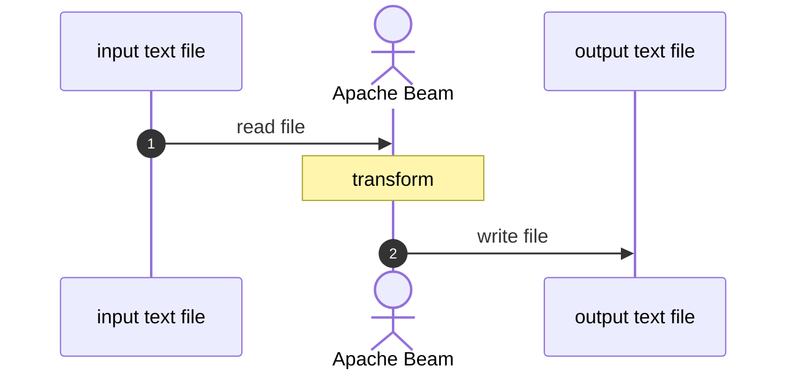

# sample-beam: part 06 IO - case A : text

## about

- This repo is for demonstrating how to use Beam IO functions in Python.
- It is written aside blogs described below.
- This is part A : Text file.
- Works with [Google Cloud Storage](https://cloud.google.com/storage).

## blog related

- [EN] [Let's try: Apache Beam part 6 - instant IO](https://www.bluebirz.net/en/lets-try-apache-beam-part-6/)
- [TH] [มาใช้ Apache Beam กันเถอะ – ตอนที่ 6 IO สำเร็จรูป](https://www.bluebirz.net/th/lets-try-apache-beam-part-6-th/)
- [Medium] [Let’s try: Apache Beam part 6 — instant IO](https://medium.com/@bluebirz/lets-try-apache-beam-part-6-instant-io-fae7f79b1801)

## Flowchart



## How to run

### Prerequisites

1. Require python env.
2. Install dependencies.

```shell
pip install -r requirements.txt
```

### Run locally

```shell
cd src
python3 main.py \
  --runner=DirectRunner \
  --input_file="resources/sample.txt" \
  --output_file="resources/output.txt"
```

### Run on Google Dataflow

1. Submit an image

```shell
gcloud builds submit . \
  --tag LOCATION-docker.pkg.dev/PROJECT_ID/REPO_NAME/IMAGE_PATH:TAG
```

2. Copy a sample file to Google Cloud Storage

```shell
gsutil cp resources/sample.txt gs://<bucket>/<path>/<file.txt>
```

3. Run dataflow from the image

```shell
cd src
python -m main \
  --runner=DataflowRunner \
  --experiments=use_runner_v2 \
  --project=PROJECT_ID \
  --input_file="gs://<bucket>/<path>/<file.txt>" \
  --output_file="gs://<bucket>/<path>/<output_file.txt>" \
  --region=LOCATION \
  --temp_location=GCS_TEMP_LOCATION \
  --sdk_container_image=LOCATION-docker.pkg.dev/PROJECT_ID/REPO_NAME/IMAGE_PATH:TAG
```

### Cleanup

- Delete files from Google Cloud Storage

```shell
gsutil rm gs://<bucket>/<path>/<file.txt>
```
