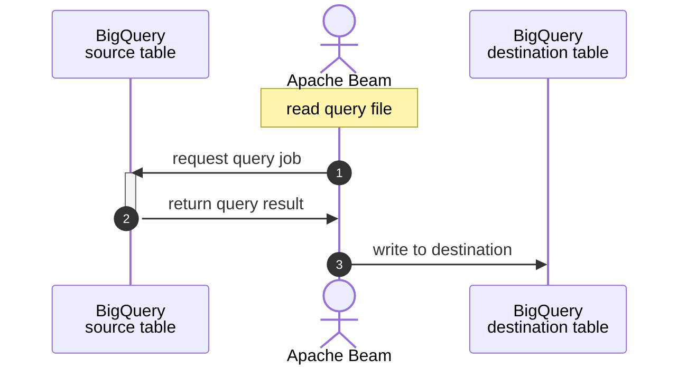

# sample-beam: part 06 IO - case B : Google BigQuery

## about

- This repo is for demonstrating how to use Beam IO functions in Python.
- It is written aside blogs described below.
- This is part B : [Google BigQuery](https://cloud.google.com/bigquery).
- This will query from Google BigQuery Public datasets [covid19_nyt](https://console.cloud.google.com/bigquery?p=bigquery-public-data&d=covid19_nyt&page=dataset).

## blog related

- [EN] []()
- [TH] []()
- [Medium] []()

## Flowchart



## How to run

### Prerequisites

1. Require python env.
2. Install dependencies.

```shell
pip install -r requirements.txt
```

3. Create BigQuery dataset

```shell
bq mk -d <output_dataset>
```

4. Create Bigquery dataset as Beam temporary dataset in same region as source table in the query. Otherwise, Beam will automatically create temporary dataset every time it runs.

```shell
bq mk -d --location US <beam_temp_dataset>
```

### Run locally

```shell
cd src
python3 main.py \
  --runner=DirectRunner \
  --project=PROJECT_ID \
  --temp_location=GCS_TEMP_LOCATION \
  --input_query_file="resources/query.sql" \
  --output_dataset="<output_dataset>" \
  --output_table="<output_table>" \
  --temp_datasetId="<beam_temp_dataset>"
```

### Run on Google Dataflow

1. Submit an image

```shell
gcloud builds submit . \
  --tag LOCATION-docker.pkg.dev/PROJECT_ID/REPO_NAME/IMAGE_PATH:TAG
```

2. Run dataflow from the image

```shell
cd src
python -m main \
  --runner=DataflowRunner \
  --experiments=use_runner_v2 \
  --project=PROJECT_ID \
  --input_query_file="resources/query.sql" \
  --output_dataset="<output_dataset>" \
  --output_table="<output_table>" \
  --temp_datasetId="<beam_temp_dataset>" \
  --region=LOCATION \
  --temp_location=GCS_TEMP_LOCATION \
  --sdk_container_image=LOCATION-docker.pkg.dev/PROJECT_ID/REPO_NAME/IMAGE_PATH:TAG
```

### Cleanup

- Delete output dataset

```shell
bq rm -r -f -d <output_dataset>
```

- Delete Beam temporary dataset

```shell
bq rm -r -f -d <dataflow_temp_dataset>
```

## Reference

- [autodetect schema](https://stackoverflow.com/a/67643669)
- [Google Dataflow temporary dataset](https://beam.apache.org/releases/pydoc/2.36.0/apache_beam.io.gcp.bigquery.html)
