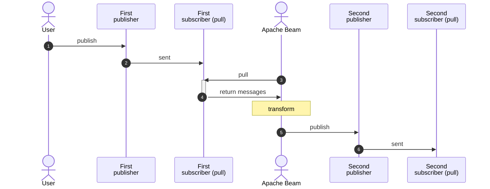

# sample-beam: part 06 IO - case C : Google Cloud Pub/Sub

## about

- This repo is for demonstrating how to use Beam IO functions in Python.
- It is written aside blogs described below.
- This is part C : [Google Cloud Pub/Sub](https://cloud.google.com/pubsub).

## blog related

- [EN] [Let's try: Apache Beam part 6 - instant IO](https://www.bluebirz.net/en/lets-try-apache-beam-part-6/)
- [TH] [มาใช้ Apache Beam กันเถอะ – ตอนที่ 6 IO สำเร็จรูป](https://www.bluebirz.net/th/lets-try-apache-beam-part-6-th/)
- [Medium] [Let’s try: Apache Beam part 6 — instant IO](https://medium.com/@bluebirz/lets-try-apache-beam-part-6-instant-io-fae7f79b1801)

## Flowchart



## How to run

### Prerequisites

1. Require python env.
2. Google Cloud Pub/Sub topics and subscriptions and permission to edit.
3. Install dependencies.

```shell
pip install -r requirements.txt
```

3. Create Google Cloud Pub/Sub topics and subscribers.

```shell
gcloud pubsub topics create first_publisher
gcloud pubsub subscriptions create first_subscriber --topic=first_publisher
gcloud pubsub topics create second_publisher
gcloud pubsub subscriptions create second_subscriber --topic=second_publisher
```

### Run locally

```shell
cd src
python3 main.py \
  --runner=DirectRunner \
  --project=PROJECT_ID \
  --input_subscription="first_subscriber" \
  --output_topic="second_publisher"
```

### Run on Google Dataflow

1. Submit an image

```shell
gcloud builds submit . \
  --tag LOCATION-docker.pkg.dev/PROJECT_ID/REPO_NAME/IMAGE_PATH:TAG
```

2. Run dataflow from the image

```shell
cd src
python -m main \
  --runner=DataflowRunner \
  --experiments=use_runner_v2 \
  --project=PROJECT_ID \
  --input_subscription="first_subscriber" \
  --output_topic="second_publisher" \
  --region=LOCATION \
  --sdk_container_image=LOCATION-docker.pkg.dev/PROJECT_ID/REPO_NAME/IMAGE_PATH:TAG
```

### Send a message to a topic

```shell
gcloud pubsub topics publish TOPIC_NAME --message='<message>'
```

### Pull messages from a subscription

```shell
gcloud pubsub subscriptions pull SUBSCRIPTION --limit=LIMIT
```

### Purge messages from a subscription

```shell
gcloud pubsub subscriptions seek SUBSCRIPTION --time=<future_time_format_yyyy-mm-dd>
```

### Cleanup

- Delete topics and subscriptions

```shell
gcloud pubsub topics delete first_publisher
gcloud pubsub topics delete second_publisher
gcloud pubsub subscriptions delete first_subscriber
gcloud pubsub subscriptions delete second_subscriber
```
