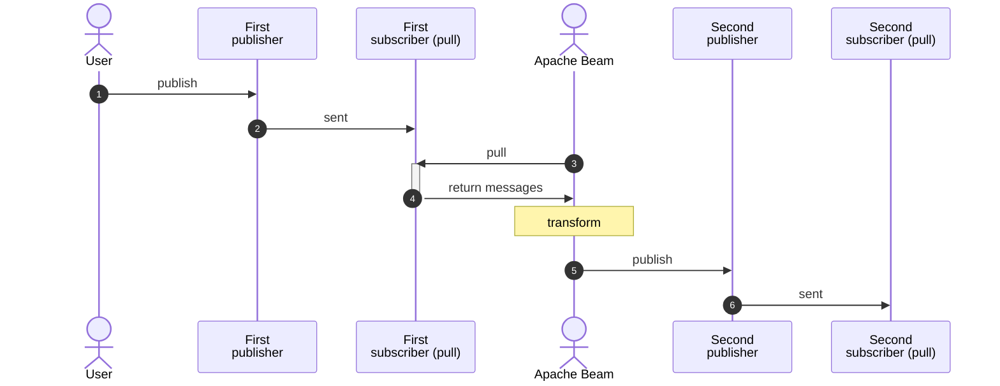

# sample-beam: part 06 IO - case C : Google Cloud Pub/Sub

## about

- This repo is for demonstrating how to create a Beam IO functions in Python.
- It is written aside blogs described below.
- This is part D : [Google Cloud Firestore](https://firebase.google.com/docs/firestore).

## blog related

- [EN] []()
- [TH] []()
- [Medium] []()

## Flowchart



## How to run

### Prerequisites

1. Require python env.
2. Install dependencies.

```shell
pip install -r requirements.txt
```

### Run locally

```shell
cd src
python3 main.py \
  --runner=DirectRunner \
  --project=PROJECT_ID \
  --source_collection="<source_collection>" \
  --destination_collection="<destination_collection>"
```

### Run on Google Dataflow

1. Submit an image

```shell
gcloud builds submit . \
  --tag LOCATION-docker.pkg.dev/PROJECT_ID/REPO_NAME/IMAGE_PATH:TAG
```

2. Run dataflow from the image

```shell
cd src
python -m main \
  --runner=DataflowRunner \
  --experiments=use_runner_v2 \
  --project=PROJECT_ID \
  --source_collection="<source_collection>" \
  --destination_collection="<destination_collection>" \
  --region=LOCATION \
  --sdk_container_image=LOCATION-docker.pkg.dev/PROJECT_ID/REPO_NAME/IMAGE_PATH:TAG
```

## References

- [Developing I/O connectors for Python](https://beam.apache.org/documentation/io/developing-io-python/#implementing-the-boundedsource-subclass)
