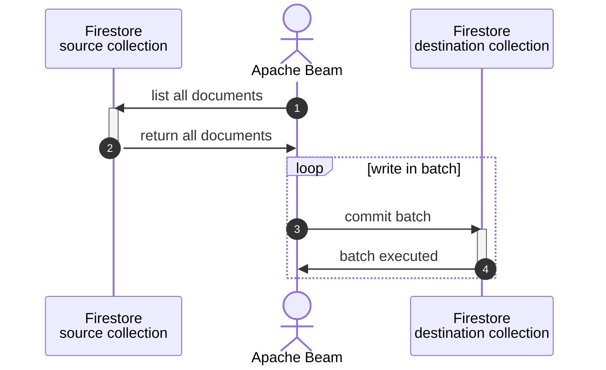

# sample-beam: part 07 Custom IO

## about

- This repo is for demonstrating how to create a Beam IO functions in Python.
- [Google Cloud Firestore](https://firebase.google.com/docs/firestore) custom IO is chose in this case.
- It demonstrates a new class inheriting:
  - `apache_beam.io.iobase.BoundedSource` and
  - `apache_beam.DoFn`
- It is written aside blogs described below.

## blog related

- [EN] [Let's try: Apache Beam part 7 - custom IO](https://www.bluebirz.net/en/lets-try-apache-beam-part-7)
- [TH] [มาใช้ Apache Beam กันเถอะ – ตอนที่ 7 IO ที่สร้างได้](https://www.bluebirz.net/th/lets-try-apache-beam-part-7-th)
- [Medium] [Let's try: Apache Beam part 7 - custom IO](https://medium.com/@bluebirz/lets-try-apache-beam-part-7-custom-io-d310fc291e88)

## Flowchart



## How to run

### Prerequisites

1. Require python env.
2. Firestore database and permission to edit.
3. Install dependencies.

```shell
pip install -r requirements.txt
```

### Run locally

```shell
cd src
python3 main.py \
  --runner=DirectRunner \
  --project=PROJECT_ID \
  --source_collection="<source_collection>" \
  --destination_collection="<destination_collection>"
```

### Run on Google Dataflow

1. Submit an image

```shell
gcloud builds submit . \
  --tag LOCATION-docker.pkg.dev/PROJECT_ID/REPO_NAME/IMAGE_PATH:TAG
```

2. Run dataflow from the image

```shell
cd src
python -m main \
  --runner=DataflowRunner \
  --experiments=use_runner_v2 \
  --project=PROJECT_ID \
  --source_collection="<source_collection>" \
  --destination_collection="<destination_collection>" \
  --region=LOCATION \
  --sdk_container_image=LOCATION-docker.pkg.dev/PROJECT_ID/REPO_NAME/IMAGE_PATH:TAG
```

## References

- [Developing I/O connectors for Python](https://beam.apache.org/documentation/io/developing-io-python/#implementing-the-boundedsource-subclass)
- [Firestore: Get all documents in a collection](https://firebase.google.com/docs/firestore/query-data/get-data#get_all_documents_in_a_collection)
- [Firestore: Batched writes](https://firebase.google.com/docs/firestore/manage-data/transactions#batched-writes)
- [ParDo with DoFn methods](https://beam.apache.org/documentation/transforms/python/elementwise/pardo/#example-3-pardo-with-dofn-methods)
